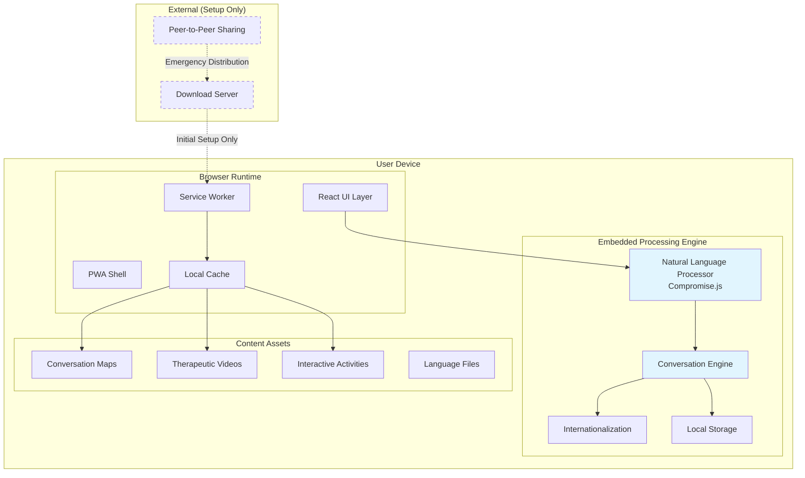
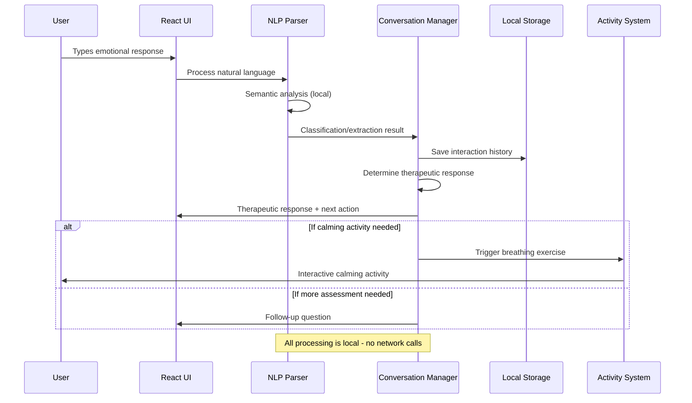
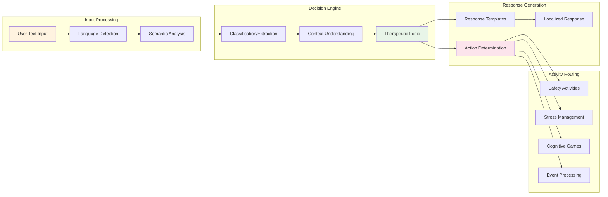
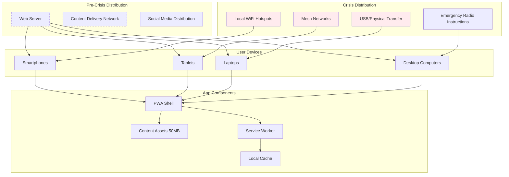
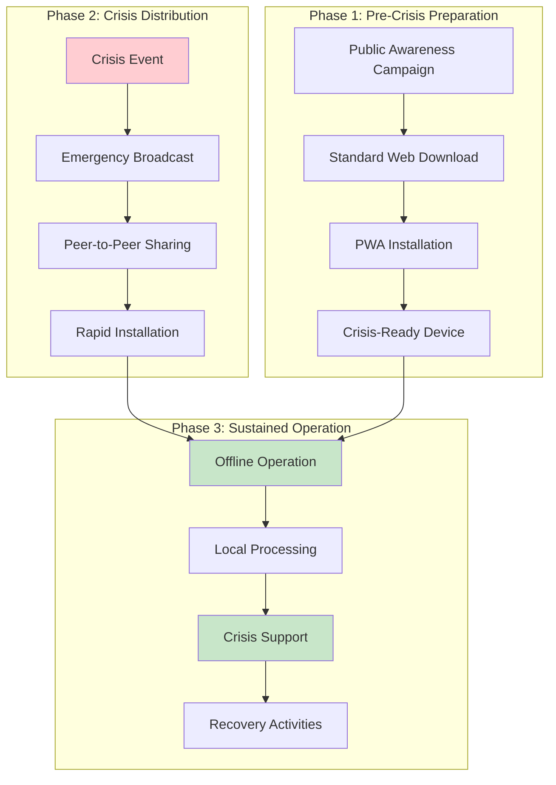
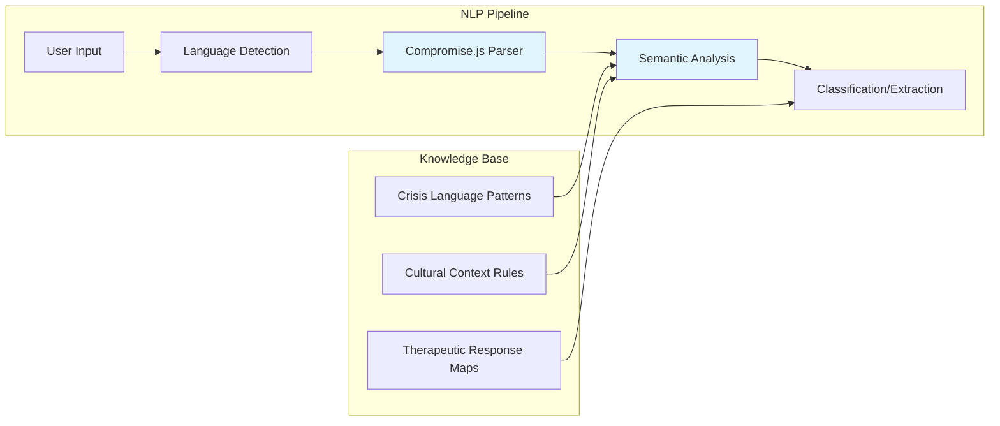
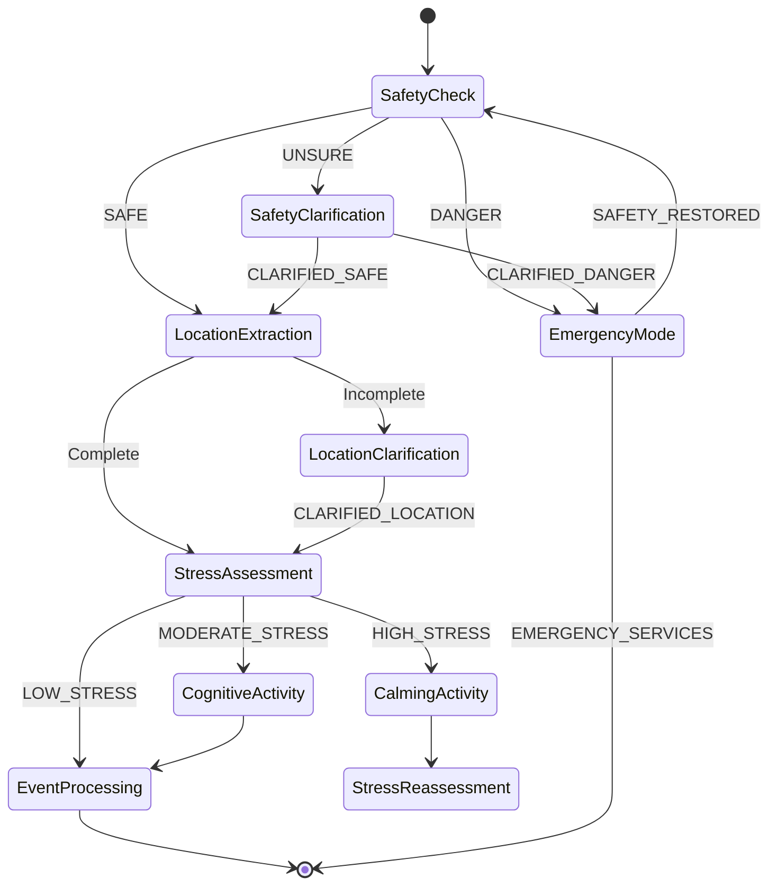
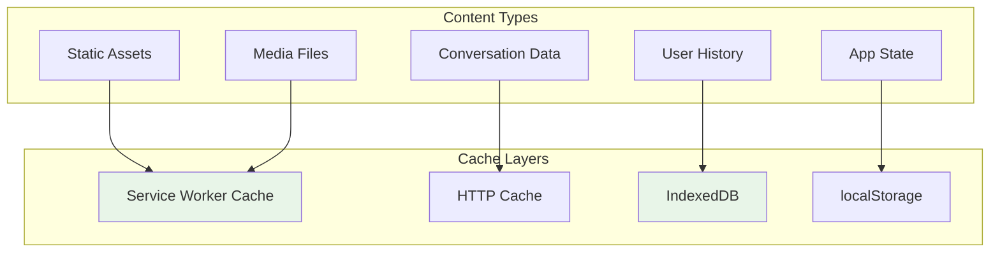

# **CALMe** Trauma Response App - Architecture Document

## Executive Summary

### Hackathon Context: Israeli Population Resilience During War

This application addresses a critical gap in mental health support during active conflict situations in Israel. Traditional trauma response systems fail during emergencies when network infrastructure is compromised, emergency services are overwhelmed, and immediate professional help is unavailable.

**The Problem**: During rocket attacks, terror incidents, and ongoing conflict, civilians need immediate trauma support but face:
- Overwhelmed emergency mental health services
- Network outages preventing access to cloud-based apps
- Language barriers (Hebrew/English/Arabic populations)
- Panic responses that require natural language understanding, not rigid questionnaires
- Need for immediate coping mechanisms without waiting for professional intervention

**Our Solution**: A downloadable PWA that provides trauma-informed crisis support completely offline:
- **Natural language processing** understands panic responses like "אני לא יכול לנשום" (I can't breathe) or "everything is spinning"
- **Contextual therapeutic responses** guide users through safety assessment → stress management → cognitive recovery
- **True offline operation** works during network outages and infrastructure attacks
- **Culturally appropriate** with Hebrew/Arabic/English support and trauma-informed design
- **Shareable in crisis** - 50MB app transfers quickly via local networks or USB during emergencies

**Impact Potential**: Scales trauma support to entire population during mass casualty events, providing immediate psychological first aid when professional systems are overwhelmed.

---

## 1. Architectural Overview

### 1.1 Core Architecture Principles

**Offline-First Design**
- Zero network dependencies after initial download
- All processing happens locally on device
- No cloud services or API dependencies that could fail during infrastructure attacks

**Natural Language Understanding**
- Semantic text analysis vs rigid questionnaires
- Handles emotional, fragmented crisis language
- Culturally appropriate responses in multiple languages

**Progressive Enhancement**
- Works on any modern browser (Chrome 70+, Safari 11.3+, Firefox 65+)
- Scales from basic smartphones to desktop computers
- Degrades gracefully on older devices

**Crisis-Optimized UX**
- Text-only interface (no audio/video requirements)
- Silent mode for active danger situations
- Quick loading (<3 seconds) during high-stress moments

### 1.2 System Architecture Diagram

### 1.3 Component Interaction Diagram

### 1.4 Data Flow Architecture

---

## 2. Architectural Assumptions

### 2.1 Technical Assumptions

**Device Capabilities**
- Target devices have 1GB+ RAM and Chrome 70+ browser support
- Users can download 50MB initial app size (acceptable for crisis preparedness)
- Local storage capacity of 100MB+ available for app data
- JavaScript execution environment supports ES2015+ features

**Network Environment**
- Initial download requires stable internet connection (30-60 seconds)
- Post-installation operation assumes zero network reliability
- Emergency sharing occurs via local WiFi, Bluetooth, or physical media transfer
- Infrastructure attacks may disable cellular/internet for extended periods

**User Context**
- Users may be in high-stress, panic states with limited cognitive capacity
- Crisis responses are often fragmented, emotional, and non-linear
- Multiple languages may be needed in same household/shelter
- Silent operation required during active danger (rocket attacks, sheltering)

### 2.2 Clinical Assumptions

**Therapeutic Framework**
- Psychological first aid principles apply in crisis situations
- Safety assessment must precede emotional processing
- Progressive calming activities reduce acute stress responses
- Natural language understanding improves therapeutic rapport vs rigid forms

**Cultural Context**
- Hebrew-speaking users express trauma differently than English speakers
- Cultural references (locations, institutions) must be locally relevant
- Family/community context is primary concern in Israeli crisis response
- Religious/cultural sensitivities affect coping mechanism acceptance

### 2.3 Deployment Assumptions

**Distribution Model**
- App can be pre-distributed during calm periods for crisis preparedness
- Emergency distribution relies on peer-to-peer sharing networks
- No app store approval process required (direct web installation)
- Single app version serves entire population (no device-specific variants)

**Maintenance**
- App operates independently without updates during crisis periods
- Conversation content can be updated during calm periods
- No real-time configuration or remote management capabilities
- Self-contained operation for weeks/months if necessary

---

## 3. Architectural Alternatives Analysis

### 3.1 Alternative 1: Native Mobile Apps

**Approach**: Separate iOS/Android native applications
**Why Rejected**:
- **App store dependencies**: Could be unavailable during infrastructure attacks
- **Platform fragmentation**: Requires separate development/maintenance for iOS/Android
- **Distribution complexity**: Cannot be shared peer-to-peer in emergency situations
- **Update dependencies**: Requires app store updates that may not reach users in crisis

**Trade-offs**: Native apps offer better performance and OS integration, but fail crisis availability requirements

### 3.2 Alternative 2: Server-Based Web Application

**Approach**: Traditional web app with server-side NLP processing
**Why Rejected**:
- **Network dependency**: Fails completely during infrastructure attacks
- **Single point of failure**: Server outages disable entire system during mass casualties
- **Scalability issues**: Cannot handle population-scale concurrent usage during crisis
- **Latency problems**: Network delays unacceptable during panic responses

**Trade-offs**: Server-based offers more sophisticated NLP but violates offline-first requirement

### 3.3 Alternative 3: Hybrid App with Cloud Fallback

**Approach**: Native app with local processing + cloud backup
**Why Rejected**:
- **Complexity**: Dual code paths increase failure points
- **Network leakage**: Users may unknowingly depend on cloud features
- **Security concerns**: Network traffic during sensitive crisis moments
- **Testing complexity**: Must verify offline functionality under all conditions

**Trade-offs**: Offers best-of-both-worlds but introduces reliability complexity unacceptable for crisis use

### 3.4 Alternative 4: Simple Static Website

**Approach**: Basic HTML/CSS/JS without PWA capabilities
**Why Rejected**:
- **No installation**: Cannot be quickly accessed during crisis without typing URLs
- **Limited offline**: Basic caching insufficient for rich media content
- **No native integration**: Cannot appear as app icon for quick crisis access
- **Limited functionality**: No background processing or advanced caching strategies

**Trade-offs**: Simpler implementation but inadequate user experience for crisis scenarios

### 3.5 Chosen Architecture: Offline-First PWA

**Why Selected**:
- **True offline operation**: Works completely without network after setup
- **Universal compatibility**: Runs on any modern device/browser
- **Crisis-optimized installation**: Appears as native app for quick access
- **Peer-to-peer shareable**: Can be distributed via local networks
- **Embedded intelligence**: Full NLP processing without network dependency
- **Incremental enhancement**: Progressive loading suitable for emergency distribution

---

## 4. Deployment Architecture

### 4.1 Deployment Diagram

### 4.2 Distribution Strategy Architecture

---

## 5. Technical Architecture Decisions

### 5.1 Natural Language Processing Architecture

**Decision**: Compromise.js for local semantic analysis
**Rationale**: 
- 2MB library vs 25MB+ for TensorFlow.js alternatives
- Sufficient crisis language understanding without cloud dependencies
- Extensible for Hebrew through custom linguistic rules
- No training data requirements or model updates needed

**Architecture Pattern**:

### 5.2 Conversation Flow Architecture

**Decision**: Finite State Machine with therapeutic routing
**Rationale**:
- Predictable conversation flow essential for crisis response
- Social worker input directly maps to state transitions
- Supports both classification (multiple choice) and extraction (open-ended) question types
- Allows for dynamic routing based on user safety status

**State Machine Architecture**:

### 5.3 Offline Storage Architecture

**Decision**: Layered caching with Service Worker + IndexedDB
**Rationale**:
- Service Worker ensures resource availability during network outages
- IndexedDB provides structured storage for conversation history and user progress
- Cache API handles static assets (videos, images, conversation maps)
- localStorage for simple configuration and state persistence

**Storage Architecture**:

---

## 6. Quality Attributes & Architectural Strategies

### 6.1 Reliability

**Requirements**: 99.9% uptime during crisis, no network dependencies
**Architectural Strategy**:
- Embedded processing eliminates external service dependencies
- Comprehensive offline caching prevents network failure scenarios
- Graceful degradation for partial functionality on resource-constrained devices
- Local state persistence survives app/device restarts

### 6.2 Performance

**Requirements**: <3 second load time, <150MB RAM usage, works on 1GB devices
**Architectural Strategy**:
- Lazy loading of non-critical components (advanced activities, extra languages)
- Compressed video assets (480p H.264, <7MB per 3-minute video)
- Efficient NLP processing with minimal memory footprint
- Service Worker pre-caching for instant subsequent loads

### 6.3 Usability

**Requirements**: Usable during high-stress, panic states by non-technical users
**Architectural Strategy**:
- Natural language input eliminates complex UI navigation
- Progressive disclosure of functionality based on user state
- Culturally appropriate visual design and interaction patterns
- Silent mode for situations requiring stealth operation

### 6.4 Scalability

**Requirements**: Support population-scale usage during mass casualty events
**Architectural Strategy**:
- Client-side processing eliminates server bottlenecks
- Peer-to-peer distribution reduces bandwidth requirements
- Self-contained operation prevents cascade failures
- No user account or authentication systems to overload

### 6.5 Security & Privacy

**Requirements**: No data transmission during crisis, private conversation history
**Architectural Strategy**:
- Local-only processing ensures no sensitive data leaves device
- No cloud storage or analytics that could be compromised
- User conversation history stored locally with device encryption
- No tracking or identification mechanisms

---

## 7. Architectural Testing Strategy

### 7.1 Offline Resilience Testing

**Architecture Validation**:
- Network disconnection testing during all user workflows
- Service Worker cache verification for complete asset coverage
- Graceful handling of partial cache states during interrupted downloads
- Battery drain testing during extended offline operation

### 7.2 Natural Language Understanding Validation

**Semantic Processing Testing**:
- Crisis language corpus validation in Hebrew and English
- Emotional state classification accuracy under stress scenarios
- Cultural context understanding for location references and family structures
- False positive/negative analysis for safety assessment classifications

### 7.3 Cross-Platform Compatibility Testing

**Universal Access Validation**:
- Browser compatibility matrix testing (Chrome 70+, Safari 11.3+, Firefox 65+)
- Device capability testing across RAM/storage constraints
- PWA installation flow validation on iOS/Android/desktop
- Accessibility compliance for users with disabilities during crisis

### 7.4 Crisis Scenario Integration Testing

**End-to-End Crisis Simulation**:
- Simulated network outage during active user sessions
- Multi-user concurrent usage testing for family/shelter scenarios
- Language switching during conversation flow
- Transition between safety assessment and therapeutic activities

### 7.5 Performance Under Stress Testing

**Resource Constraint Validation**:
- Memory usage profiling during extended conversations
- CPU usage optimization for older mobile devices
- Storage efficiency for long-term offline operation
- Thermal management during intensive local processing

---

## 8. Future Architectural Considerations

### 8.1 Scalability Extensions

**Multi-Language Expansion**:
- Modular language pack architecture for Arabic, Russian, Amharic
- Cultural adaptation framework for different trauma response patterns
- Community-contributed conversation maps for specific populations

**Enhanced Therapeutic Capabilities**:
- AI-powered conversation analysis for improved therapeutic routing
- Biometric integration for physiological stress assessment
- Group therapy session facilitation for shelter environments

### 8.2 Integration Possibilities

**Emergency Services Integration**:
- Optional data export for professional follow-up after crisis
- Anonymous usage analytics for population mental health monitoring
- Integration with emergency broadcast systems for crisis communication

**Community Resilience Features**:
- Peer support network formation during extended crisis periods
- Community resource sharing and coordination
- Neighborhood-level crisis preparedness tools

---

## 9. Architectural Risks & Mitigations

### 9.1 Technical Risks

| Risk | Impact | Probability | Mitigation |
|------|--------|-------------|------------|
| Browser compatibility issues | High | Medium | Comprehensive testing matrix, graceful degradation |
| Storage quota limitations | Medium | Medium | Tiered content caching, optional asset downloading |
| NLP accuracy limitations | High | Low | Extensive corpus testing, fallback clarification flows |
| Performance on old devices | Medium | High | Progressive enhancement, minimal resource requirements |

### 9.2 Operational Risks

| Risk | Impact | Probability | Mitigation |
|------|--------|-------------|------------|
| Incomplete initial download | High | Medium | Resume capability, essential-first downloading |
| User confusion during crisis | High | Medium | Simplified UI, clear navigation cues |
| Content inappropriateness | High | Low | Clinical review process, cultural sensitivity testing |
| Distribution challenges | Medium | High | Multiple distribution channels, viral sharing design |

### 9.3 Clinical Risks

| Risk | Impact | Probability | Mitigation |
|------|--------|-------------|------------|
| Misclassification of danger | Very High | Low | Conservative safety thresholds, professional review |
| Inadequate therapeutic response | Medium | Medium | Evidence-based therapeutic protocols, expert validation |
| Cultural insensitivity | Medium | Medium | Cultural consultant review, community feedback integration |
| Over-reliance vs professional help | Medium | High | Clear scope limitations, professional referral guidance |

---

## Conclusion

This architecture provides a robust, offline-first solution for trauma response during crisis situations affecting the Israeli population. The design prioritizes reliability and accessibility over sophisticated features, ensuring that basic psychological support remains available even under extreme circumstances.

The embedded natural language processing approach, combined with comprehensive offline capabilities, creates a system that can scale to population-level usage without infrastructure dependencies. The PWA distribution model enables rapid deployment through multiple channels, from pre-crisis preparation to emergency peer-to-peer sharing.

Key architectural strengths include crisis-optimized user experience, universal device compatibility, and therapeutic evidence-based conversation flows that adapt to individual user needs while maintaining clinical safety standards.
