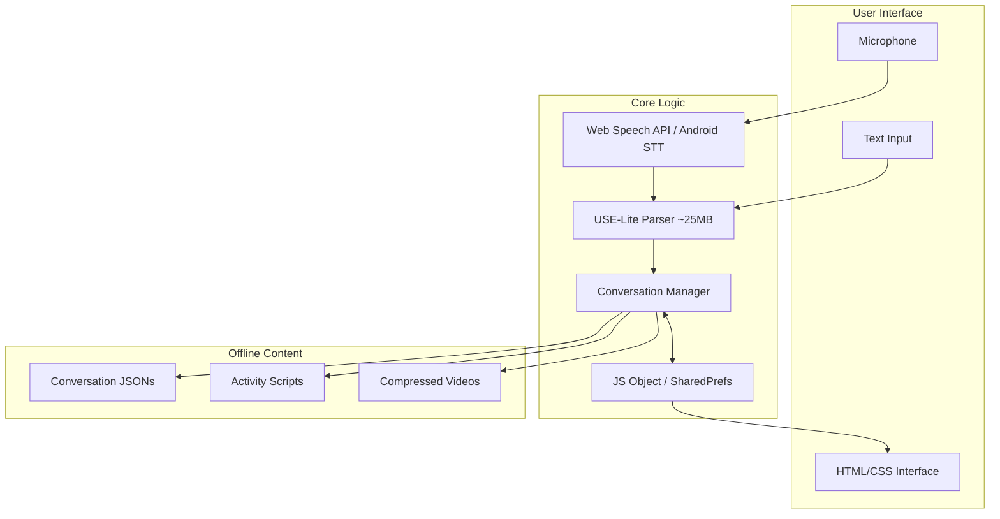

# Trauma Response App - Developer Implementation Guide

**Note on Documentation Links**: All documentation links in this guide were valid as of the guide's creation. Please verify current URLs and version numbers before implementation, especially for:
- TensorFlow.js CDN links (use @latest or check current stable version)
- Android API documentation (may have moved with new Android versions)
- npm package versions

## Project Goal

### What We're Building
Build an offline-first mobile app that helps people during traumatic events (terror attacks, bombings, natural disasters) by:
- Assessing their safety status through natural conversation
- Providing immediate stress management activities
- Offering cognitive games for distraction
- Helping process the event afterward

The app guides users through a structured therapeutic process:
1. Safety confirmation
2. Stress assessment
3. Calming activities (if stressed)
4. Cognitive games (when ready)
5. Event processing (if safe)

### Critical Requirements
- **Must work completely offline** in shelters/bunkers with no network access
- **Must understand natural language** - not just keywords, but phrases like "I can't stop shaking"
- **Must run on old devices** - Android 5.0+ with 1GB RAM
- **Must respect silent mode** during active danger (no sounds/vibration)
- **Must be shareable** - <110MB total for peer-to-peer transfer in emergencies
- **Must load quickly** - <3 seconds after initial setup
- **Must preserve battery** - minimal background processing

## Architecture Overview

### Why This Architecture Matters

This app is designed for crisis situations where:
- **Every second counts**: Initial setup takes 30 seconds, but thereafter loads in <3 seconds
- **Natural language is critical**: USE-Lite adds 25MB but understands "I can't breathe" means panic, not a medical issue
- **Old devices are common**: In emergencies, people use whatever phone works - we target Android 5.0+
- **Battery life is critical**: Efficient code and minimal background processing preserve battery
- **Sharing is essential**: At 110MB the app can still be shared via local WiFi in shelters
- **True understanding required**: There's no substitute for semantic understanding in crisis response

The USE-Lite model is our biggest component, but it's non-negotiable. When someone types "everything is spinning and I can't stop shaking," keywords won't help - we need real language understanding.

### System Architecture



### Technology Stack

| Component | Web App (PWA) | Android Native | Why This Choice |
|-----------|--------------|----------------|-----------------|
| **Core** | Vanilla JS | Kotlin | No framework overhead |
| **UI** | Custom CSS (~10KB) | XML layouts | Built-in, no libraries |
| **Speech** | Web Speech API | Android STT | Device built-in, free |
| **Storage** | localStorage + IndexedDB | SharedPreferences | Simple, reliable |
| **Parser** | TensorFlow.js USE-Lite (25MB) | TF Lite USE-Lite (25MB) | Understands natural language |
| **Video** | HTML5 `<video>` | VideoView | Native players |
| **Games** | Canvas API | WebView | No game engine needed |

**Documentation**: [TensorFlow.js](https://www.tensorflow.org/js) | [Universal Sentence Encoder](https://tfhub.dev/google/universal-sentence-encoder-lite/2)

**Platform Documentation**: 
- [Web Speech API](https://developer.mozilla.org/en-US/docs/Web/API/Web_Speech_API)
- [IndexedDB](https://developer.mozilla.org/en-US/docs/Web/API/IndexedDB_API)
- [Service Workers](https://developer.mozilla.org/en-US/docs/Web/API/Service_Worker_API)

#### What We're NOT Using (and Why)
- ❌ React (150KB) → ✅ Vanilla JS (0KB)
- ❌ Full TensorFlow.js (2.8MB) → ✅ USE-Lite only (25MB) - Worth it for natural language
- ❌ Phaser.js (900KB) → ✅ Canvas API (0KB)
- ❌ Tailwind CSS (3MB) → ✅ Custom CSS (10KB)

**Parser Decision**: USE-Lite (Universal Sentence Encoder) is the only parser that reliably handles crisis language like "I can't stop shaking" or "everything feels unreal." The 25MB is non-negotiable for proper trauma response.

### Target Specifications
- **Total App Size**: ~110MB including all content
  - Core app: ~2MB
  - USE-Lite model: ~25MB (downloaded once, cached)
  - Videos (480p H.264): ~75MB for 15 minutes total
  - Games & activities: ~5MB
  - Audio prompts: ~2MB
  - Conversations & data: ~1MB
- **Minimum Android**: API 21 (Android 5.0) - covers 98.1% of devices
- **Minimum iOS Safari**: 11.3 (for Web Speech API)
- **RAM Usage**: <150MB active memory (including model)
- **No external dependencies** during runtime after initial setup
- **Offline speech recognition**: Uses device's built-in engine (next version)

## Implementation Guide

### Social Worker Integration Process

The social worker provides conversation maps using the "Technical Specification Template for Conversation Design" document. Here's how to convert their specifications into code:

1. **Receive the conversation map** with:
   - Question IDs and text
   - Response categories with keywords
   - Sample user responses for each category
   - Therapeutic responses
   - Next question routing

2. **Convert to JSON format**:
   ```javascript
   // From social worker's table format:
   // Category: SAFE | Keywords: safe, yes, secure | Sample: "Yes I'm safe"
   
   // To developer JSON:
   "SAFE": {
     keywords: ["safe", "yes", "secure"],
     sampleResponses: ["Yes I'm safe"],
     response: "[therapeutic response from social worker]",
     next: "[next question ID from social worker]"
   }
   ```

3. **Add the samples to all_questions.json** for USE-Lite training

4. **Test each question** with the sample responses to ensure proper categorization

### Core Components

#### 1. Conversation Data Structure

This structure is generated from the social worker's conversation planning document. The social worker provides:
- Question text and IDs
- Response categories with keywords and sample responses  
- Pre-written therapeutic responses
- Routing logic (which question comes next)
- Clarification prompts

The dev team converts this into the JSON format below:

```javascript
const conversationTree = {
  "SAFETY_1": {
    id: "SAFETY_1",
    text: "Hi there. First, I need to know - are you currently in a safe place?",
    categories: {
      "SAFE": {
        keywords: ["safe", "yes", "secure", "okay", "fine", "shelter", "bunker", "protected", "home", "inside", "good"],
        sampleResponses: [
          "Yes I'm safe",
          "I'm in the shelter now",
          "We made it home",
          "I'm okay",
          "Finally inside and secure",
          "yes we're all fine here"
        ],
        description: "User confirms they are currently safe",
        response: "Good, I'm relieved you're safe. Take a deep breath with me. Now, how are you feeling emotionally?",
        next: "STRESS_1",
        actions: []
      },
      "DANGER": {
        keywords: ["no", "danger", "help", "scared", "attack", "sirens", "running", "outside", "exposed", "emergency"],
        sampleResponses: [
          "No",
          "Still hearing sirens",
          "Help",
          "There are explosions",
          "Can't find shelter",
          "We're trapped outside"
        ],
        description: "User indicates they are in danger",
        response: "I understand. Your safety is most important. Follow your emergency protocol. I'm switching to silent mode.",
        next: "EMERGENCY_CHECKLIST",
        actions: ["ENABLE_SILENT_MODE"]
      },
      "UNSURE": {
        keywords: ["maybe", "don't know", "think so", "not sure", "confused", "possibly"],
        sampleResponses: [
          "I think so?",
          "Not sure",
          "Maybe",
          "Hard to tell",
          "idk the sirens stopped but",
          "might be safe now"
        ],
        description: "User is uncertain about their safety",
        response: "Let's make sure you're safe. Are you inside a building or shelter right now?",
        next: "SAFETY_2",
        actions: ["REDUCE_NOTIFICATIONS"]
      }
    },
    clarificationPrompt: "I want to make sure I understand your situation. Can you tell me - are you somewhere safe right now?",
    contextHelp: "Users may be panicked and give unclear responses. Look for safety indicators vs danger signals.",
    default: "UNSURE"
  }
  // ... more questions
};
```

#### 2. Natural Language Parser with USE-Lite

**Critical Requirement**: Users must be able to express themselves naturally, especially when distressed. [USE-Lite (Universal Sentence Encoder)](https://tfhub.dev/google/universal-sentence-encoder-lite/2) understands semantic meaning, so "I can't stop shaking" correctly maps to high stress.

**Quick Links**: 
- [TensorFlow.js Documentation](https://www.tensorflow.org/js/guide)
- [USE-Lite Model Card](https://tfhub.dev/google/universal-sentence-encoder-lite/2)
- [TensorFlow.js USE Tutorial](https://github.com/tensorflow/tfjs-models/tree/master/universal-sentence-encoder)

```javascript
// parser.js - USE-Lite implementation
class USEParser {
  constructor() {
    this.modelReady = false;
    this.embeddings = {};
  }

  async init() {
    try {
      // Load USE-Lite model (~25MB, cached after first download)
      console.log('Loading language understanding model...');
      this.model = await use.loadQnA();
      
      // Pre-compute embeddings for all conversation categories
      await this.prepareEmbeddings();
      
      this.modelReady = true;
      console.log('Parser ready');
    } catch (error) {
      console.error('Failed to load USE-Lite:', error);
      throw new Error('Cannot initialize language parser');
    }
  }

  async prepareEmbeddings() {
    // Pre-compute embeddings for each question's categories
    // This runs once at startup, then queries are fast
    
    const conversationData = await fetch('/conversations/all_questions.json');
    const questions = await conversationData.json();
    
    for (const [questionId, question] of Object.entries(questions)) {
      this.embeddings[questionId] = {};
      
      for (const [categoryId, category] of Object.entries(question.categories)) {
        // Combine all example texts for this category
        const examples = [
          ...category.sampleResponses,
          ...category.keywords.map(k => `I am ${k}`),
          category.description
        ];
        
        // Create embeddings for this category
        const categoryEmbeddings = await this.model.embed(examples);
        this.embeddings[questionId][categoryId] = categoryEmbeddings;
      }
    }
  }

  async parse(userInput, questionNode) {
    if (!this.modelReady) {
      throw new Error('Parser not ready');
    }

    // Embed the user's input
    const inputEmbedding = await this.model.embed([userInput]);
    
    // Compare to pre-computed category embeddings
    let bestMatch = null;
    let bestScore = -1;
    
    for (const [categoryId, categoryEmbeddings] of Object.entries(this.embeddings[questionNode.id])) {
      // Calculate similarity to this category
      const similarity = await this.calculateMaxSimilarity(inputEmbedding, categoryEmbeddings);
      
      if (similarity > bestScore) {
        bestScore = similarity;
        bestMatch = categoryId;
      }
    }
    
    // Return result or request clarification
    if (bestScore < 0.65) {
      return {
        category: 'NEEDS_CLARIFICATION',
        confidence: bestScore,
        clarifyPrompt: questionNode.clarificationPrompt
      };
    }
    
    return {
      category: bestMatch,
      confidence: bestScore
    };
  }

  async calculateMaxSimilarity(inputEmbedding, categoryEmbeddings) {
    // Find the highest similarity score with any example in the category
    const dotProducts = tf.matMul(inputEmbedding, categoryEmbeddings, false, true);
    const inputNorm = tf.norm(inputEmbedding, 2, 1);
    const categoryNorms = tf.norm(categoryEmbeddings, 2, 1);
    
    // Cosine similarity calculation
    const normProduct = tf.mul(
      inputNorm.expandDims(1), 
      categoryNorms.expandDims(0)
    );
    const similarities = tf.div(dotProducts, normProduct);
    
    // Get maximum similarity
    const maxSimilarity = await tf.max(similarities).data();
    
    // Critical: Clean up tensors to prevent memory leaks
    dotProducts.dispose();
    inputNorm.dispose();
    categoryNorms.dispose();
    normProduct.dispose();
    similarities.dispose();
    
    return maxSimilarity[0];
  }
}

// Example usage showing how it handles natural language
const testExamples = {
  "I can't stop shaking": "DANGER",  // Understands panic
  "everything feels unreal": "DANGER",  // Understands dissociation
  "we're ok but scared": "SAFE",  // Understands mixed emotions
  "idk maybe": "NEEDS_CLARIFICATION"  // Low confidence → clarify
};
```

##### Integration in HTML

```html
<!-- Add these scripts to your index.html -->
<script src="https://cdn.jsdelivr.net/npm/@tensorflow/tfjs@latest"></script>
<script src="https://cdn.jsdelivr.net/npm/@tensorflow-models/universal-sentence-encoder@latest"></script>
<script src="parser.js"></script>
```

##### Why USE-Lite is Required

Simple keyword matching fails on real crisis language:
- "I can't breathe" → Not just about respiratory issues, indicates panic
- "Everything is spinning" → Not about dizziness, indicates severe anxiety  
- "My chest is tight" → Could be panic attack, not heart problem
- "I feel nothing" → Serious dissociation, not calm

USE-Lite understands these semantic meanings because it was trained on millions of text examples. There's no shortcut for this capability.

**What USE-Lite Provides**:
- Understands context: "safe but scared" → SAFE (not DANGER)
- Handles typos: "im ok but shakinf" → still understood
- Grasps emotion: "can't stop crying" → high stress
- Works across languages: Can be extended to support multiple languages with same model

The 25MB investment pays off when lives are at stake.

#### 3. Conversation Manager

Handles conversation flow, parse results (including clarifications), and state management:

```javascript
class ConversationManager {
  constructor(conversationTree) {
    this.tree = conversationTree;
    this.parser = new USEParser();
    this.state = this.loadState() || {
      currentNode: "SAFETY_1",
      history: [],
      mode: "NORMAL"
    };
  }

  async processInput(userInput) {
    const node = this.tree[this.state.currentNode];
    const parseResult = await this.parser.parse(userInput, node);
    
    // Handle clarification needed
    if (parseResult.category === 'NEEDS_CLARIFICATION') {
      return {
        text: parseResult.clarifyPrompt || node.clarificationPrompt,
        needsClarification: true,
        nextNode: this.state.currentNode // Stay on same question
      };
    }
    
    const responseData = node.categories[parseResult.category];
    
    // Save interaction (lightweight)
    this.state.history.push({
      q: node.id,
      input: userInput.substring(0, 50), // Truncate for privacy
      cat: parseResult.category,
      time: Date.now()
    });
    if (this.state.history.length > 20) this.state.history.shift();
    
    // Execute actions
    for (const action of responseData.actions || []) {
      if (action === 'ENABLE_SILENT_MODE') {
        this.state.mode = 'SILENT';
        window.appConfig = { silent: true };
      }
    }
    
    // Update state and persist
    this.state.currentNode = responseData.next;
    localStorage.setItem('conversation_state', JSON.stringify(this.state));
    
    return {
      text: responseData.response,
      nextNode: responseData.next,
      needsClarification: false
    };
  }

  loadState() {
    try {
      return JSON.parse(localStorage.getItem('conversation_state'));
    } catch {
      return null;
    }
  }
}
```

### Activity System

The app includes three activity types, each serving different purposes during crisis response:

#### 1. Breathing Exercise (Interactive)

Interactive exercises that guide users through timed breathing patterns. Examples include 4-7-8 breathing, box breathing, and belly breathing. These use CSS animations and vanilla JavaScript timers.

**Related Documentation**: [CSS Animations](https://developer.mozilla.org/en-US/docs/Web/CSS/CSS_Animations) | [setTimeout](https://developer.mozilla.org/en-US/docs/Web/API/setTimeout)

```javascript
class BreathingExercise {
  render(container) {
    container.innerHTML = `
      <style>
        .breathing-circle {
          width: 150px; height: 150px;
          background: #4A90E2;
          border-radius: 50%;
          margin: 50px auto;
          transition: transform 4s ease-in-out;
        }
        .breathing-circle.inhale { transform: scale(1.5); }
        .breathing-circle.exhale { transform: scale(1); }
      </style>
      <div class="breathing-circle" id="circle"></div>
      <div id="instructions">Breathe In...</div>
      <button onclick="breathing.stop()">Done</button>
    `;
    this.start();
  }

  start() {
    const circle = document.getElementById('circle');
    const instructions = document.getElementById('instructions');
    const phases = [
      { text: 'Breathe In...', class: 'inhale', duration: 4000 },
      { text: 'Hold...', class: 'inhale', duration: 4000 },
      { text: 'Breathe Out...', class: 'exhale', duration: 4000 }
    ];
    
    let i = 0;
    const runPhase = () => {
      instructions.textContent = phases[i].text;
      circle.className = `breathing-circle ${phases[i].class}`;
      i = (i + 1) % phases.length;
      this.timer = setTimeout(runPhase, phases[i].duration);
    };
    runPhase();
  }

  stop() {
    clearTimeout(this.timer);
    this.onComplete?.();
  }
}
```

#### 2. Video Exercise (Multimedia)

Pre-recorded video content for guided exercises. Examples include guided meditation videos, stretching routines, and progressive muscle relaxation. Videos are compressed to 480p H.264 for maximum compatibility and small file size.

**Related Documentation**: [HTML5 Video Element](https://developer.mozilla.org/en-US/docs/Web/HTML/Element/video) | [Video Encoding Guide](https://developer.mozilla.org/en-US/docs/Web/Media/Formats/Video_codecs)

```javascript
class VideoExercise {
  render(container) {
    container.innerHTML = `
      <video width="100%" controls playsinline>
        <source src="/videos/${this.videoName}.mp4" type="video/mp4">
      </video>
      <button onclick="video.complete()">Done</button>
    `;
    
    const video = container.querySelector('video');
    video.addEventListener('ended', () => this.complete());
  }
  
  complete() {
    this.onComplete?.();
  }
}
```

#### 3. Cognitive Games (Canvas-based)

Puzzle and logic games that require focused attention. Examples include Sudoku, memory matching, word search, and pattern recognition games. These are implemented as lightweight vanilla JavaScript components, no game engines required.

**Related Documentation**: [Canvas API](https://developer.mozilla.org/en-US/docs/Web/API/Canvas_API) | [CSS Grid](https://developer.mozilla.org/en-US/docs/Web/CSS/CSS_Grid_Layout)

```javascript
class MemoryGame {
  constructor() {
    this.cards = this.shuffleCards(['A','A','B','B','C','C','D','D']);
    this.flipped = [];
    this.matched = [];
  }

  render(container) {
    container.innerHTML = `
      <style>
        .memory-grid { 
          display: grid; 
          grid-template-columns: repeat(4, 80px); 
          gap: 10px; 
        }
        .card { 
          width: 80px; height: 80px; 
          background: #4A90E2; 
          display: flex; 
          align-items: center; 
          justify-content: center; 
          font-size: 24px; 
          cursor: pointer; 
        }
        .card.flipped { background: white; }
        .card.matched { opacity: 0.5; }
      </style>
      <div class="memory-grid" id="grid"></div>
      <button onclick="memory.exit()">Exit Game</button>
    `;
    
    this.renderCards();
  }

  renderCards() {
    const grid = document.getElementById('grid');
    this.cards.forEach((value, index) => {
      const card = document.createElement('div');
      card.className = 'card';
      card.dataset.index = index;
      card.onclick = () => this.flipCard(index);
      grid.appendChild(card);
    });
  }

  flipCard(index) {
    // Game logic here
  }

  shuffleCards(cards) {
    return cards.sort(() => Math.random() - 0.5);
  }
}
```

#### Activity Transitions

```javascript
class ActivityManager {
  async transitionToActivity(type, params) {
    // Save conversation state
    sessionStorage.setItem('returnNode', this.currentNode);
    
    // Fade transition
    document.body.style.opacity = '0';
    await new Promise(r => setTimeout(r, 300));
    
    // Load activity
    const container = document.getElementById('app');
    switch(type) {
      case 'breathing':
        const breathing = new BreathingExercise();
        breathing.onComplete = () => this.returnToConversation();
        breathing.render(container);
        break;
      case 'video':
        const video = new VideoExercise();
        video.videoName = params.videoName;
        video.onComplete = () => this.returnToConversation();
        video.render(container);
        break;
      case 'game':
        const game = new MemoryGame();
        game.onComplete = () => this.returnToConversation();
        game.render(container);
        break;
    }
    
    document.body.style.opacity = '1';
  }

  returnToConversation() {
    const returnNode = sessionStorage.getItem('returnNode');
    // Show: "Welcome back. How are you feeling after that exercise?"
    this.conversationManager.resume(returnNode + '_RETURN');
  }
}
```

### Platform-Specific Implementation

#### Android USE-Lite Parser

Android uses [TensorFlow Lite](https://www.tensorflow.org/lite) with the same USE-Lite model for consistency:

**Note**: For Android, include `use_lite.tflite` (~25MB) in the assets folder. Total APK size will be ~110MB.

**Android Documentation**:
- [TensorFlow Lite Android Guide](https://www.tensorflow.org/lite/guide/android)
- [Android SpeechRecognizer](https://developer.android.com/reference/android/speech/SpeechRecognizer)
- [SharedPreferences](https://developer.android.com/training/data-storage/shared-preferences)

```kotlin
// USEParser.kt
class USEParser(private val context: Context) {
    private lateinit var interpreter: Interpreter
    private lateinit var embeddings: Map<String, Map<String, Array<FloatArray>>>
    private var isReady = false
    
    suspend fun init() = withContext(Dispatchers.IO) {
        // Note: Uses Kotlin Coroutines - https://kotlinlang.org/docs/coroutines-overview.html
        try {
            // Load USE-Lite TFLite model (~25MB)
            val modelBuffer = loadModelFile("use_lite.tflite")
            interpreter = Interpreter(modelBuffer)
            
            // Pre-compute embeddings
            prepareEmbeddings()
            
            isReady = true
            Log.d("USEParser", "Parser initialized")
        } catch (e: Exception) {
            Log.e("USEParser", "Failed to initialize", e)
            throw Exception("Cannot initialize language parser")
        }
    }
    
    private fun loadModelFile(modelName: String): ByteBuffer {
        val assetFileDescriptor = context.assets.openFd(modelName)
        val inputStream = FileInputStream(assetFileDescriptor.fileDescriptor)
        val fileChannel = inputStream.channel
        val startOffset = assetFileDescriptor.startOffset
        val declaredLength = assetFileDescriptor.declaredLength
        return fileChannel.map(FileChannel.MapMode.READ_ONLY, startOffset, declaredLength)
    }
    
    private suspend fun prepareEmbeddings() {
        // Load conversation data
        val conversationJson = context.assets.open("conversations/all_questions.json")
            .bufferedReader().use { it.readText() }
        val questions = JSONObject(conversationJson)
        
        embeddings = mutableMapOf()
        
        // Pre-compute embeddings for each category
        questions.keys().forEach { questionId ->
            val question = questions.getJSONObject(questionId)
            val categories = question.getJSONObject("categories")
            val questionEmbeddings = mutableMapOf<String, Array<FloatArray>>()
            
            categories.keys().forEach { categoryId ->
                val category = categories.getJSONObject(categoryId)
                val examples = mutableListOf<String>()
                
                // Collect all example texts
                val samples = category.getJSONArray("sampleResponses")
                for (i in 0 until samples.length()) {
                    examples.add(samples.getString(i))
                }
                
                // Generate embeddings
                val categoryEmbeddings = examples.map { text ->
                    encodeText(text)
                }.toTypedArray()
                
                questionEmbeddings[categoryId] = categoryEmbeddings
            }
            
            embeddings[questionId] = questionEmbeddings
        }
    }
    
    fun parse(userInput: String, questionId: String): ParseResult {
        if (!isReady) throw Exception("Parser not ready")
        
        // Encode user input
        val inputEmbedding = encodeText(userInput)
        
        // Find best matching category
        var bestMatch: String? = null
        var bestScore = -1f
        
        embeddings[questionId]?.forEach { (categoryId, categoryEmbeddings) ->
            val maxSimilarity = categoryEmbeddings.map { embedding ->
                cosineSimilarity(inputEmbedding, embedding)
            }.maxOrNull() ?: -1f
            
            if (maxSimilarity > bestScore) {
                bestScore = maxSimilarity
                bestMatch = categoryId
            }
        }
        
        return if (bestScore < 0.65f) {
            ParseResult(
                category = "NEEDS_CLARIFICATION",
                confidence = bestScore
            )
        } else {
            ParseResult(
                category = bestMatch!!,
                confidence = bestScore
            )
        }
    }
    
    private fun encodeText(text: String): FloatArray {
        // USE-Lite encoding implementation
        // Input/output tensor handling
        val inputIds = tokenize(text)
        val outputTensor = Array(1) { FloatArray(512) } // USE-Lite output dimension
        
        interpreter.run(inputIds, outputTensor)
        return outputTensor[0]
    }
    
    private fun cosineSimilarity(a: FloatArray, b: FloatArray): Float {
        var dotProduct = 0f
        var normA = 0f
        var normB = 0f
        
        for (i in a.indices) {
            dotProduct += a[i] * b[i]
            normA += a[i] * a[i]
            normB += b[i] * b[i]
        }
        
        return dotProduct / (sqrt(normA) * sqrt(normB))
    }
}

data class ParseResult(
    val category: String,
    val confidence: Float
)
```

#### Android Offline Storage

```kotlin
class OfflineContentManager(private val context: Context) {
    private val prefs = context.getSharedPreferences("app_state", Context.MODE_PRIVATE)
    
    fun loadConversation(id: String): String {
        return context.assets.open("conversations/$id.json").bufferedReader().use { 
            it.readText() 
        }
    }
    
    fun getVideoUri(name: String): Uri {
        val resId = context.resources.getIdentifier(name, "raw", context.packageName)
        return Uri.parse("android.resource://${context.packageName}/$resId")
    }
}
```

### Offline Implementation

#### Content Structure
```
app/
├── index.html (2KB)
├── app.js (30KB minified)
├── parser.js (15KB - USE-Lite wrapper)
├── styles.css (10KB)
├── conversations/
│   ├── from_social_worker/     # Original planning documents
│   ├── all_questions.json      # All Q&A for USE-Lite training (20KB)
│   ├── safety_check.json       # Conversation flow (5KB)
│   └── stress_assessment.json  # Conversation flow (5KB)
├── videos/
│   ├── breathing_3min.mp4 (11MB)
│   ├── grounding_5min.mp4 (19MB)
│   └── relaxation_7min.mp4 (26MB)
├── audio/
│   └── bell.mp3 (50KB)
└── manifest.json

Note: USE-Lite model (~25MB) loads from CDN and caches automatically
```

#### Service Worker (PWA)

**Documentation**: [Progressive Web Apps](https://developer.mozilla.org/en-US/docs/Web/Progressive_web_apps) | [Service Worker API](https://developer.mozilla.org/en-US/docs/Web/API/Service_Worker_API)

```javascript
const CACHE_NAME = 'trauma-response-v1';
const urlsToCache = [
  '/', '/index.html', '/app.js', '/parser.js', '/styles.css',
  '/conversations/all_questions.json',
  '/conversations/safety_check.json',
  '/conversations/stress_assessment.json',
  '/videos/breathing_3min.mp4',
  '/audio/bell.mp3'
  // Note: USE-Lite model is cached automatically by TensorFlow.js
];

self.addEventListener('install', event => {
  event.waitUntil(
    caches.open(CACHE_NAME)
      .then(cache => cache.addAll(urlsToCache))
      .then(() => self.skipWaiting())
  );
});

self.addEventListener('fetch', event => {
  // Special handling for TensorFlow model files
  if (event.request.url.includes('tfhub.dev') || 
      event.request.url.includes('storage.googleapis.com')) {
    event.respondWith(
      caches.match(event.request).then(response => {
        if (response) return response;
        
        // First time: fetch and cache the model
        return fetch(event.request).then(response => {
          return caches.open(CACHE_NAME).then(cache => {
            cache.put(event.request, response.clone());
            return response;
          });
        });
      })
    );
    return;
  }
  
  // Regular files
  event.respondWith(
    caches.match(event.request).then(response => 
      response || new Response('Offline content not found', { status: 404 })
    )
  );
});
```

### Testing Natural Language Understanding

The USE-Lite parser must be tested with real user inputs collected from:
1. User research sessions with target populations
2. Crisis counselor feedback on actual phrases used
3. Social media posts during emergencies (anonymized)

Example test suite for SAFETY_1:
```javascript
const safetyTestCases = [
  // Clear safe
  { input: "yes I'm in the shelter", expected: "SAFE" },
  { input: "we made it inside thank god", expected: "SAFE" },
  { input: "I'm home now", expected: "SAFE" },
  
  // Clear danger  
  { input: "no still outside hearing explosions", expected: "DANGER" },
  { input: "HELP", expected: "DANGER" },
  { input: "sirens everywhere can't move", expected: "DANGER" },
  
  // Ambiguous - should trigger clarification
  { input: "idk", expected: "NEEDS_CLARIFICATION" },
  { input: "the shaking stopped but", expected: "NEEDS_CLARIFICATION" },
  { input: "maybe? hard to tell", expected: "NEEDS_CLARIFICATION" },
  
  // Emotional responses that imply danger
  { input: "I can't breathe everything is spinning", expected: "DANGER" },
  { input: "so scared", expected: "DANGER" },
  
  // Complex responses
  { input: "my kids are crying but we're in the basement", expected: "SAFE" },
  { input: "safe for now but worried", expected: "SAFE" }
];

// Test the parser
async function testParser() {
  const parser = new USEParser();
  await parser.init();
  
  for (const testCase of safetyTestCases) {
    const result = await parser.parse(testCase.input, questionNodes.SAFETY_1);
    console.log(`Input: "${testCase.input}"`);
    console.log(`Expected: ${testCase.expected}, Got: ${result.category}`);
    console.log(`Confidence: ${result.confidence}`);
  }
}
```

**Critical**: Test with actual crisis counselors who can validate that the categorizations match clinical best practices. USE-Lite will handle variations and typos naturally.

### Quick Start Guide

#### First-Time Setup Note
The USE-Lite model downloads on first use (~25MB). This takes 10-30 seconds depending on connection speed. Show clear progress to users:
- "Setting up language understanding..."
- "This one-time download helps me understand you better..."
- "Almost ready..."

After the first download, the model is cached and loads in <3 seconds.

#### Social Worker to Developer Workflow
1. Receive conversation map from social worker (Excel/document format)
2. Convert to JSON structure following the format in section 3.1
3. Place all questions in `all_questions.json` for USE-Lite training
4. Create individual conversation flow files (safety_check.json, etc.)
5. Test with sample responses provided by social worker

#### Important First-Use UX
```javascript
// Show download progress
async function initWithProgress() {
  const statusEl = document.getElementById('status');
  
  // Check if model is already cached
  if (localStorage.getItem('model_cached')) {
    statusEl.textContent = "Loading emergency support...";
  } else {
    statusEl.textContent = "First-time setup: Downloading language model...";
    // Consider showing a progress bar if possible
  }
  
  try {
    await parser.init();
    localStorage.setItem('model_cached', 'true');
    statusEl.textContent = "Ready to help.";
  } catch (error) {
    statusEl.textContent = "Setup failed. Please check internet and refresh.";
  }
}
```

#### Project Setup (Web/PWA)
```bash
project/
├── index.html
├── app.js
├── parser.js (USE-Lite wrapper)
├── manifest.json
├── conversations/ 
│   ├── from_social_worker/  # Original specs from social worker
│   │   └── conversation_map.xlsx
│   ├── all_questions.json   # Converted from social worker specs
│   ├── safety_check.json    # Individual conversation flows
│   └── stress_assessment.json
├── videos/ (compressed to 480p)
└── service-worker.js
```

#### Basic HTML Structure
```html
<!DOCTYPE html>
<html>
<head>
    <meta name="viewport" content="width=device-width, initial-scale=1">
    <link rel="manifest" href="/manifest.json">
    <!-- TensorFlow.js and USE-Lite -->
    <!-- Note: Check for latest versions at https://www.tensorflow.org/js/tutorials/setup -->
    <script src="https://cdn.jsdelivr.net/npm/@tensorflow/tfjs@latest"></script>
    <script src="https://cdn.jsdelivr.net/npm/@tensorflow-models/universal-sentence-encoder@latest"></script>
    <!-- Documentation: https://github.com/tensorflow/tfjs-models/tree/master/universal-sentence-encoder -->
</head>
<body>
    <div id="app">
        <div id="conversation"></div>
        <input type="text" id="userInput" placeholder="Type your response...">
        <button onclick="app.processInput()">Send</button>
    </div>
    <script src="parser.js"></script>
    <script src="app.js"></script>
</body>
</html>
```

#### Initialize App
```javascript
// app.js
const app = {
  async init() {
    try {
      // Show loading message
      this.showMessage("Loading emergency support system...");
      
      // Initialize USE-Lite parser (this takes 10-30 seconds first time)
      this.showMessage("Preparing language understanding (one-time download)...");
      this.parser = new USEParser();
      await this.parser.init();
      
      // Load conversation tree
      const response = await fetch('/conversations/safety_check.json');
      const conversationData = await response.json();
      
      // Initialize components
      this.conversationTree = conversationData;
      this.manager = new ConversationManager(this.conversationTree);
      this.manager.parser = this.parser;
      this.activities = new ActivityManager();
      
      // Register service worker for offline use
      if ('serviceWorker' in navigator) {
        await navigator.serviceWorker.register('/service-worker.js');
      }
      
      // Cache the model for next time
      await this.cacheModel();
      
      // Show first question
      this.showQuestion();
    } catch (error) {
      console.error('Failed to initialize:', error);
      this.showMessage("Setup failed. Please check your internet connection and refresh.");
    }
  },
  
  async cacheModel() {
    // USE-Lite model is automatically cached by the browser
    // but we can store a flag to know it's ready
    localStorage.setItem('model_cached', 'true');
  },
  
  async processInput() {
    const input = document.getElementById('userInput').value;
    const response = await this.manager.processInput(input);
    
    // Show response
    this.showResponse(response.text);
    
    // Handle clarification needs
    if (response.needsClarification) {
      // Stay on same question, just show clarification prompt
      document.getElementById('userInput').value = '';
      document.getElementById('userInput').focus();
      return;
    }
    
    // Check for activity triggers
    if (response.nextNode.startsWith('ACTIVITY_')) {
      this.activities.transitionToActivity(
        response.nextNode.split('_')[1].toLowerCase()
      );
    } else {
      this.showQuestion();
    }
  },
  
  showMessage(text) {
    document.getElementById('conversation').innerHTML = `<p>${text}</p>`;
  },
  
  showQuestion() {
    const node = this.conversationTree[this.manager.state.currentNode];
    document.getElementById('conversation').innerHTML = `<p>${node.text}</p>`;
    document.getElementById('userInput').value = '';
    document.getElementById('userInput').focus();
  },
  
  showResponse(text) {
    const conv = document.getElementById('conversation');
    conv.innerHTML += `<p class="response">${text}</p>`;
  }
};

// Start app
app.init();
```

### Speech-to-Text Integration (Next Version)

Adding speech input is straightforward once text parsing works:

**Documentation**: [Web Speech API](https://developer.mozilla.org/en-US/docs/Web/API/Web_Speech_API/Using_the_Web_Speech_API) | [Android Speech Recognition](https://developer.android.com/reference/android/speech/RecognizerIntent)

```javascript
// Web Speech API (built into browsers)
class SpeechInput {
  constructor(onResult) {
    this.recognition = new webkitSpeechRecognition();
    this.recognition.continuous = false;
    this.recognition.interimResults = false;
    this.recognition.lang = 'en-US'; // Or user's language
    
    this.recognition.onresult = (event) => {
      const transcript = event.results[0][0].transcript;
      onResult(transcript);
    };
  }
  
  start() {
    this.recognition.start();
  }
}

// Android SpeechRecognizer (built-in)
class VoiceInputActivity : AppCompatActivity() {
    private val speechRecognizer = SpeechRecognizer.createSpeechRecognizer(this)
    
    private fun startListening() {
        val intent = Intent(RecognizerIntent.ACTION_RECOGNIZE_SPEECH).apply {
            putExtra(RecognizerIntent.EXTRA_LANGUAGE_MODEL, 
                    RecognizerIntent.LANGUAGE_MODEL_FREE_FORM)
            putExtra(RecognizerIntent.EXTRA_PREFER_OFFLINE, true)
        }
        speechRecognizer.startListening(intent)
    }
}
```

Both platforms support offline speech recognition using device models.

## Production & Deployment

### Production Tips

#### USE-Lite Best Practices
1. **Monitor confidence scores** - Log inputs that get < 0.65 confidence for improvement
2. **Test on real devices** - Some phones with <1GB RAM may struggle with TensorFlow.js
3. **Preload during splash screen** - Start loading USE-Lite immediately on app open
4. **Memory management** - Always dispose tensors to prevent memory leaks:
   ```javascript
   // Critical: Clean up after tensor operations
   tensor.dispose();
   tf.dispose(tensors);
   ```
5. **Provide fallback UI** - If model fails to load after 60 seconds:
   ```javascript
   function showManualCategorization(questionNode) {
     const buttons = Object.entries(questionNode.categories).map(([id, cat]) => 
       `<button onclick="selectCategory('${id}')">${cat.buttonText || id}</button>`
     ).join('');
     
     document.getElementById('app').innerHTML = `
       <p>I'm having trouble understanding. Please select what best describes your situation:</p>
       ${buttons}
     `;
   }
   ```

### Performance Optimization
- Cache parsed conversation JSON in memory after first load
- Use `requestAnimationFrame` for smooth activity transitions
- Lazy load videos only when activity is selected
- Keep conversation history to max 20 entries to limit memory use
- Pre-compute all category embeddings during initialization
- Dispose TensorFlow tensors immediately after use

### Deployment Checklist

#### Social Worker Deliverables
- [ ] Received conversation map with all questions, categories, and responses
- [ ] Converted social worker's format to JSON structure
- [ ] All sample responses included in all_questions.json
- [ ] Clarification prompts provided for each question
- [ ] Routing logic (next question) specified for each response

#### Technical Implementation
- [ ] USE-Lite loads successfully on target devices (test 30-second first load)
- [ ] Model caching works offline after first use
- [ ] Clarification prompts feel conversational
- [ ] Videos compressed to 480p H.264 (target: 5MB/minute)
- [ ] Service worker caches TensorFlow model files
- [ ] Tested on Android 5.0 device with 1GB RAM
- [ ] Total app size ~110MB (including USE-Lite model)
- [ ] Loads in <30 seconds first time, <3 seconds thereafter
- [ ] Works completely offline after initial model download
- [ ] Silent mode disables all audio/vibration

#### Testing & Validation
- [ ] Parser tested with 50+ real user responses per question
- [ ] Confidence threshold (0.65) tuned for good balance
- [ ] Tested with crisis counselors for clinical accuracy
- [ ] Graceful error handling if USE-Lite fails to load
- [ ] Fallback UI available for manual category selection

### Additional Resources

#### Core Technologies
- [TensorFlow.js Documentation](https://www.tensorflow.org/js)
- [Universal Sentence Encoder (USE-Lite)](https://tfhub.dev/google/universal-sentence-encoder-lite/2)
- [TensorFlow Lite for Android](https://www.tensorflow.org/lite/guide/android)
- [Progressive Web Apps Guide](https://web.dev/progressive-web-apps/)

#### Web APIs
- [Service Worker API](https://developer.mozilla.org/en-US/docs/Web/API/Service_Worker_API)
- [IndexedDB API](https://developer.mozilla.org/en-US/docs/Web/API/IndexedDB_API)
- [Web Speech API](https://developer.mozilla.org/en-US/docs/Web/API/Web_Speech_API)
- [Canvas API](https://developer.mozilla.org/en-US/docs/Web/API/Canvas_API)

#### Android Development
- [Android Speech Recognition](https://developer.android.com/reference/android/speech/SpeechRecognizer)
- [SharedPreferences](https://developer.android.com/training/data-storage/shared-preferences)
- [Android Offline First Apps](https://developer.android.com/topic/architecture/data-layer/offline-first)

#### Optimization & Best Practices
- [Video Codec Guide](https://developer.mozilla.org/en-US/docs/Web/Media/Formats/Video_codecs)
- [PWA Offline Cookbook](https://web.dev/offline-cookbook/)
- [TensorFlow.js Performance](https://www.tensorflow.org/js/guide/platform_environment)